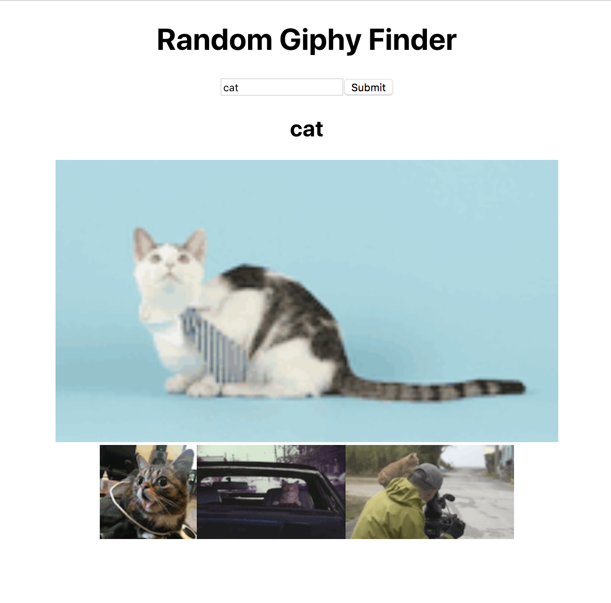

# Hands-on React Workshop - Exercise 3 - Passing Data from Parent to Child

Time to start making our app!

First we'll learn how to pass information from parent to child.

## Objectives

* Be able to use the `setState` method to change state of component
* Be able to pass information from parent to child via props
* Be able to use a lifecycle method to control procedure

## Getting Started

```js
yarn install // or npm install
yarn dev
```

Open up `localhost:8080` in your browser.

## Instructions

You'll notice that we deprecated our `Title` component and simply added it into `App`. Not everything needs to be a component 😄

The app we are going to create is a random gif generator using Giphy's free API. You can see an example of it here. I'm not designer, so please PLEASE make it look pretty!



### Giving `App` Some State

We want a nice image to appear right when we open up the app. This picture is going to change depending on what we search for, so let's make the picture part of our app's *state*.

In `components/App.jsx`, initialize `state` with:

* an image property set to this link: `https://media.giphy.com/media/12zV7u6Bh0vHpu/giphy.gif` (or whatever you would like).
* a search term set to the string: "Search"

### Create Child `CurrentGif`

We want our image to appear on the page. Let's create another component that simply displays the chosen image and also the current search term.

Because `CurrentGif` only receives information, instead of creating a new class, let's create a simple function that returns a React element.

1. In the new file `components/CurrentGif.jsx`, export a function called `CurrentGif` that takes props and returns a div that has the image and search term.

Example Skeleton:

```html
<div>
  <h2></h2> // <--- this is where the current search term should appear
   // <--- make a gif appear!
</div>
```

### Connecting Parent to Child

1. In `App`, add in your new `CurrentGif` component and pass in the image url (via the component's state) as a prop.
1. In `CurrentGif`, make the image appear by using the prop that you just passed yourself.

### Fetch Data

We want to be able to fetch more gifs using Giphy's awesome APIs.

To save you the headache of reading through Giphy's docs (although they're pretty good--yay Giphy!), we provided you with the code snippet here to fetch a random cat gif:

```js
const URL = "http://api.giphy.com/v1/gifs/random?" +
      "tag=cat" +
      "api_key=9HDQc04ELow7kn8m7L78fMhCbNtK00QG";

    fetch(URL).then(res => res.json()).then(({ data }) => {
      /* YOUR CODE TO SET STATE */
    });
```

> If you're experience issues with the API, replace the `api_key` with your own.

The way this will theoretically work is that anytime we search for a new gif, these things will happen:

* The search term state will change
* We make a request to Giphy and when they return the result, we change the image url state.

1. Write a method called `handleSearch` in our `App` component that, when called, makes a fetch request to Giphy. Using `setState`, update the image url and the search term.
1. It'd be nice to make a fetch when we first come to the page--instead of having a default picture. So where should we be fetching in our React component? We don't want to make a fetch while React is rendering elements onto the DOM because we'll be blocking progress. We want to make sure our component is *mounted* and then update. (That was a hint.)
1. We want to run `handleSearch` inside of the proper method found in this [doc](https://kapeli.com/dash_share?docset_file=React&docset_name=React&path=reactjs.org/docs/react-component.html%23componentdidupdate&platform=react&repo=Main&source=reactjs.org/docs/react-component.html&version=16.6.3).
1. When you first load the page, you *might* see the original gif if the internet is slow, but it will quickly be replaced by a random gif that we have fetched after the component has rendered. Feel free to remove the original gif.

## Review

So what happens now is that our React app renders and after the `App` component has mounted, we use `handleSearch` to fetch from Giphy. When we receive a response, we use `setState` to update the state of our `App` component. This causes another re-render to happen since our `CurrentGif` relies on information from `App`'s state.